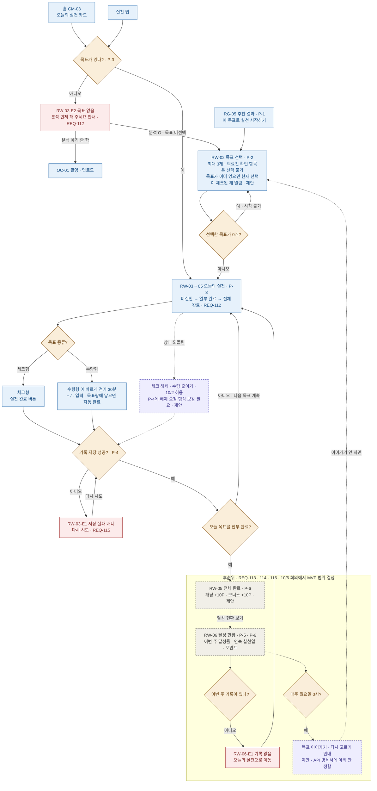
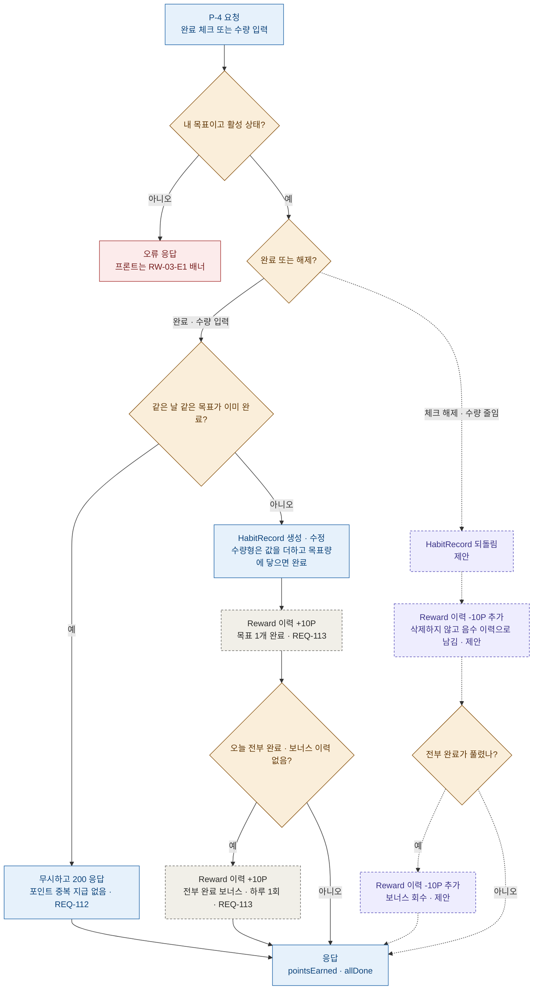

# 챌린지(실천 · 보상) 플로우차트

5팀 · 2026. 10. 3 · 작성 한성규 (피처: 챌린지)

화면 흐름과 서버 흐름을 나눠서 그렸습니다. 화면 번호는 `screen_id_table.md`, API 번호는 API 명세서 v1.2, 요구사항은 v1.4 기준입니다.

| 색 · 선 | 뜻 |
|---|---|
| 파란색 | MVP (REQ-110 · 111 · 112 · 115) |
| 회색 점선 | 후순위 (REQ-113 · 114 · 116) — 10/6 회의에서 MVP 범위 결정 |
| 보라색 점선 | 제안 (아직 팀에서 정하지 않음) |
| 주황색 | 분기 (예 / 아니오) |
| 빨간색 | 예외 화면 |

## 1. 화면 흐름

## 2. 서버 흐름 — P-4 실천 기록

`POST /habit-goals/{goalId}/records` 한 번에 서버가 하는 일입니다. 점선 · 보라색 부분은 완료 취소를 허용하기로 한 10/2 결정을 서버에 반영하기 위한 제안입니다.

## 3. 정한 것과 제안

| 항목 | 내용 | 상태 | 근거 |
|---|---|---|---|
| 목표 최대 3개 | 0개면 시작 불가, 4개 이상은 400 | 확정 | REQ-111 · API P-2 |
| RG-05 → RW-02 바로 연결 | RW-01 제외 | 확정 | REQ-110 (v1.4) |
| 연속 실천일 | 하루 1개 이상 완료하면 인정 | 확정 | 10/2 회의 |
| 완료 취소 | 허용 | 10/2 결정, 문서 반영 필요 | 아래 "문서 맞출 곳" 참고 |
| 의료진 확인 항목 | 실천 목표로 만들지 않음 | 확정 | ERD v1.2 `goal_eligible` |
| 포인트 숫자 | 목표 1개 완료마다 +10P, 하루 전부 완료 보너스 +10P (3개면 하루 최대 40P) | 제안 | API P-3 `todayPoints` · `allDoneBonus`, RW-04 화면 문구 |
| 취소할 때 포인트 | 받은 포인트를 음수 이력으로 빼고, 다시 완료하면 다시 줌 (반복해도 합계는 그대로) | 제안 | 중복 지급 금지(REQ-113) 유지 |
| 연속 실천일 끊기는 기준 | 한국 시간(Asia/Seoul) 자정 기준으로 그날 하나도 완료하지 않으면 다음 날부터 0 | 제안 | `TIMEZONE`이 이미 Asia/Seoul |
| 연속 실천일 계산 | 저장하지 않고 HabitRecord에서 매번 계산 (취소해도 자동으로 다시 맞춰짐) | 제안 | 값이 어긋날 일이 없음 |
| 목표가 이미 있는데 다시 들어오면 | 더하지 않고 교체. RW-02가 현재 선택이 체크된 채 열리고, 최종 선택(최대 3개)으로 덮어씀. 기존 기록은 남김 | 제안 | P-2가 "1~3개 묶음"을 받는 API라 자연스러움 |
| 월요일 다시 고르기 | 안내 배너, 안 바꾸면 지난주 목표 유지 | 제안 · 후순위 | REQ-116 · API 명세서 "아직 안 정함" |

## 4. 문서 맞출 곳 (이 플로우차트와 어긋나는 부분)

1. **RW-05 화면 "+30P 획득"과 API P-6 예시 `todayPoints: 30`**: 개당 10P + 보너스 10P 기준이면 3개 전부 완료는 40P이고, 마지막 목표를 완료하는 순간 받는 건 20P입니다. 숫자를 하나로 정해야 합니다.
2. **`screen_id_table.md` RW-04 행**: "완료 취소는 MVP에서 제공하지 않음"으로 남아 있어 10/2 결정(허용)과 다릅니다.
3. **API P-4**: 체크 해제 · 수량 줄이기 요청 형식이 없습니다 (현재는 `completed: true` 또는 `value`만 있음).

## 변경 이력

| 버전 | 일자 | 위치 | 현행 (As-Is) | 개정 (To-Be) | 담당 |
|---|---|---|---|---|---|
| v0.1 | 2026-10-03 | 전체 | (없음) | 챌린지 플로우차트 최초 작성 — 화면 흐름 · 서버 흐름(P-4) 분리, 화면 · API 번호, MVP · 후순위 · 제안 구분 | 성규 (Claude 초안) |
